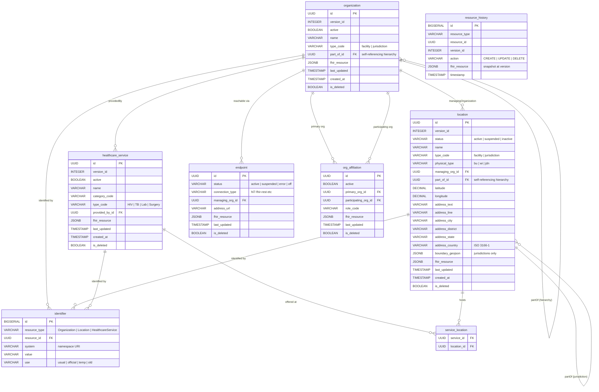

# OpenHIE Facility Registry — Project Plan & Technical Specification

> **Repository:** [wso2/reference-implementation-openhie](https://github.com/wso2/reference-implementation-openhie)
> **Component:** Facility Registry (FR)
> **Profile:** IHE mCSD (Mobile Care Services Discovery) v4.0.0
> **Version:** 1.0 — March 2026
> **Author:** Savinu Amarasekara — Rysera Innovations

---

## 1. Background & Motivation

### OpenHIE Specifications

| Registry | Specification | Link |
|----------|--------------|------|
| Facility Registry (FR) | OpenHIE FR Component Spec | [guides.ohie.org/.../openhie-facility-registry-fr](https://guides.ohie.org/arch-spec/staging/openhie-component-specifications-1/openhie-facility-registry-fr) |
| Health Worker Registry (HWR) / Provider Registry | OpenHIE HWR Component Spec | [guides.ohie.org/.../openhie-health-worker-registry-hwr](https://guides.ohie.org/arch-spec/openhie-component-specifications-1/openhie-health-worker-registry-hwr) |

### Specification Inconsistency Note

There's an inconsistency in the OpenHIE specifications — the FR is defined using the older **IHE CSD** profile (SOAP-based transactions via ITI-73/ITI-74), while the HWR/Provider Registry is defined using the newer **IHE mCSD** profile (FHIR RESTful transactions via ITI-90/ITI-91).

However, both systems fall under the same **Care Services Discovery (CSD)** domain, and mCSD is the modern FHIR-based successor to CSD. **This implementation uses mCSD for the Facility Registry**, aligning with current interoperability best practices and ensuring consistency with the Provider Registry when it is built later.

### Prior Work

The Client Registry (Master Patient Index) has already been implemented as [PR #4](https://github.com/wso2/reference-implementation-openhie/pull/4) using IHE PDQm/ATNA profiles. The Facility Registry follows the same architectural patterns.

---

## 2. Architecture

### 2.1 Deployment Units

The Facility Registry consists of three deployment units that mirror the Client Registry architecture:

| Component | Description |
|-----------|-------------|
| **`fr-core/`** | Ballerina FHIR R4 backend service. Handles all FHIR operations, mCSD transaction processing, hierarchy management, and data persistence. |
| **`audit-service/`** | Reuse FHIR AuditEvent service (from CR). Records all operations per IHE ATNA ITI-20. |
| **`fr-frontend/`** | React + OxygenUI admin dashboard. Facility search, hierarchy browser, map view, service management, bulk import, and audit log viewer. |

### 2.2 IHE mCSD Actor Mapping

| mCSD Actor | FR Component | Role |
|------------|-------------|------|
| **Directory** | fr-core | Accepts ITI-90 queries and ITI-91 history requests. Publishes CapabilityStatement. Returns FHIR Bundles of matching resources. |
| **Query Client** | fr-frontend / PoC systems | Initiates Find Matching Care Services [ITI-90] requests against the Directory. |
| **Update Client** | External systems | Consumes Request Care Services Updates [ITI-91] to pull incremental updates using FHIR `_history`. |
| **Data Source** | fr-frontend / bulk import | Feeds facility data to the Directory via Care Services Feed [ITI-130] for create/update/delete. |

### 2.3 Repository Structure

```
fr/
  fr-core/                    # Ballerina backend
    Ballerina.toml
    service.bal
    modules/
      location/
      organization/
      healthcare_service/
      endpoint/
      history/
      search/
    tests/
    resources/
  fr-frontend/                # React admin UI
    src/
      pages/
      components/
      hooks/
      services/
    package.json
  docs-site/                  # Docusaurus docs
  start.sh                    # Start all services
```

---

## 3. FHIR Resource Model for Facilities

In mCSD, a Facility is **not** a single FHIR resource. Each facility is represented as a **paired Location + Organization**:

```
Location/facility-loc-001
  name: "Colombo National Hospital"
  position: { lat: 6.9271, lng: 79.8612 }
  status: "active"
  managingOrganization: → Organization/facility-org-001   ← this is the pairing

Organization/facility-org-001
  name: "Colombo National Hospital Administration"
  partOf: → Organization/western-province-health          ← hierarchy link
```

### 3.1 Facility Resources (Location + Organization paired)

| Resource | mCSD Profile | StructureDefinition |
|----------|-------------|-------------------|
| Location (Facility) | `IHE.mCSD.FacilityLocation` | [profiles.ihe.net/.../IHE.mCSD.FacilityLocation](https://profiles.ihe.net/ITI/mCSD/StructureDefinition-IHE.mCSD.FacilityLocation.html) |
| Organization (Facility) | `IHE.mCSD.FacilityOrganization` | [profiles.ihe.net/.../IHE.mCSD.FacilityOrganization](https://profiles.ihe.net/ITI/mCSD/StructureDefinition-IHE.mCSD.FacilityOrganization.html) |

### 3.2 Jurisdiction Resources (Location + Organization paired)

| Resource | mCSD Profile | StructureDefinition |
|----------|-------------|-------------------|
| Location (Jurisdiction) | `IHE.mCSD.JurisdictionLocation` | [profiles.ihe.net/.../IHE.mCSD.JurisdictionLocation](https://profiles.ihe.net/ITI/mCSD/StructureDefinition-IHE.mCSD.JurisdictionLocation.html) |
| Organization (Jurisdiction) | `IHE.mCSD.JurisdictionOrganization` | [profiles.ihe.net/.../IHE.mCSD.JurisdictionOrganization](https://profiles.ihe.net/ITI/mCSD/StructureDefinition-IHE.mCSD.JurisdictionOrganization.html) |

### 3.3 Base Profiles (parents that Facility/Jurisdiction profiles derive from)

| Resource | mCSD Profile | StructureDefinition |
|----------|-------------|-------------------|
| Location (base) | `IHE.mCSD.Location` | [profiles.ihe.net/.../IHE.mCSD.Location](https://profiles.ihe.net/ITI/mCSD/StructureDefinition-IHE.mCSD.Location.html) |
| Organization (base) | `IHE.mCSD.Organization` | [profiles.ihe.net/.../IHE.mCSD.Organization](https://profiles.ihe.net/ITI/mCSD/StructureDefinition-IHE.mCSD.Organization.html) |

### 3.4 Service and Connectivity Resources

| Resource | mCSD Profile | StructureDefinition |
|----------|-------------|-------------------|
| HealthcareService | `IHE.mCSD.HealthcareService` | [profiles.ihe.net/.../IHE.mCSD.HealthcareService](https://profiles.ihe.net/ITI/mCSD/StructureDefinition-IHE.mCSD.HealthcareService.html) |
| Endpoint | `IHE.mCSD.Endpoint` | [profiles.ihe.net/.../IHE.mCSD.Endpoint](https://profiles.ihe.net/ITI/mCSD/StructureDefinition-IHE.mCSD.Endpoint.html) |
| OrganizationAffiliation | `IHE.mCSD.OrganizationAffiliation` | [profiles.ihe.net/.../IHE.mCSD.OrganizationAffiliation](https://profiles.ihe.net/ITI/mCSD/StructureDefinition-IHE.mCSD.OrganizationAffiliation.html) |

### 3.5 HWR-Only Resources (Future — Provider Directory)

| Resource | mCSD Profile | StructureDefinition |
|----------|-------------|-------------------|
| Practitioner | `IHE.mCSD.Practitioner` | [profiles.ihe.net/.../IHE.mCSD.Practitioner](https://profiles.ihe.net/ITI/mCSD/StructureDefinition-IHE.mCSD.Practitioner.html) |
| PractitionerRole | `IHE.mCSD.PractitionerRole` | [profiles.ihe.net/.../IHE.mCSD.PractitionerRole](https://profiles.ihe.net/ITI/mCSD/StructureDefinition-IHE.mCSD.PractitionerRole.html) |

---

## 4. Database Schema

Database: H2 (development) / PostgreSQL (production).

All core tables store a `fhir_resource JSONB` column containing the full FHIR R4 JSON for lossless round-trip fidelity, alongside denormalized columns for efficient search.

### 4.1 Entity Relationship Diagram



### 4.2 Core Tables

#### 4.2.1 `organization`

Stores FHIR Organization resources for both Facilities and Jurisdictions.

| Column | Type | Nullable | Description |
|--------|------|----------|-------------|
| `id` | UUID | No | Primary key, FHIR resource ID |
| `version_id` | INTEGER | No | FHIR `meta.versionId`, auto-incremented on update |
| `active` | BOOLEAN | No | Whether this Organization is active |
| `name` | VARCHAR(500) | No | Human-readable name |
| `type_code` | VARCHAR(100) | No | mCSD type: `facility` or `jurisdiction` |
| `part_of_id` | UUID | Yes | FK → `organization.id` (hierarchy) |
| `fhir_resource` | JSONB | No | Full FHIR R4 Organization JSON |
| `last_updated` | TIMESTAMP | No | FHIR `meta.lastUpdated`, used by ITI-91 `_since` |
| `created_at` | TIMESTAMP | No | Record creation timestamp |
| `is_deleted` | BOOLEAN | No | Soft-delete flag for history support |

#### 4.2.2 `location`

Stores FHIR Location resources for physical facilities and jurisdictions.

| Column | Type | Nullable | Description |
|--------|------|----------|-------------|
| `id` | UUID | No | Primary key, FHIR resource ID |
| `version_id` | INTEGER | No | Auto-incremented on update |
| `status` | VARCHAR(20) | No | `active` \| `suspended` \| `inactive` |
| `name` | VARCHAR(500) | No | Facility/jurisdiction name |
| `type_code` | VARCHAR(100) | No | mCSD type: `facility` or `jurisdiction` |
| `physical_type` | VARCHAR(50) | Yes | E.g., `bu` (building), `wi` (wing), `jdn` (jurisdiction) |
| `managing_org_id` | UUID | Yes | FK → `organization.id`. Required for facility type. |
| `part_of_id` | UUID | Yes | FK → `location.id` (jurisdiction hierarchy) |
| `latitude` | DECIMAL(10,7) | Yes | Geographic coordinate (WGS84) |
| `longitude` | DECIMAL(10,7) | Yes | Geographic coordinate (WGS84) |
| `address_text` | VARCHAR(1000) | Yes | Full text address for display |
| `address_line` | VARCHAR(500) | Yes | Street address line(s) |
| `address_city` | VARCHAR(200) | Yes | City/town |
| `address_district` | VARCHAR(200) | Yes | District/county |
| `address_state` | VARCHAR(200) | Yes | State/province |
| `address_country` | VARCHAR(10) | Yes | ISO 3166-1 alpha-2 country code |
| `boundary_geojson` | JSONB | Yes | GeoJSON boundary for jurisdictions |
| `fhir_resource` | JSONB | No | Full FHIR R4 Location JSON |
| `last_updated` | TIMESTAMP | No | FHIR `meta.lastUpdated` |
| `created_at` | TIMESTAMP | No | Record creation timestamp |
| `is_deleted` | BOOLEAN | No | Soft-delete flag |

#### 4.2.3 `healthcare_service`

Stores FHIR HealthcareService resources — services provided at locations.

| Column | Type | Nullable | Description |
|--------|------|----------|-------------|
| `id` | UUID | No | Primary key, FHIR resource ID |
| `version_id` | INTEGER | No | Auto-incremented on update |
| `active` | BOOLEAN | No | Whether service is currently active |
| `name` | VARCHAR(500) | No | Service name (e.g., "Surgical Services") |
| `category_code` | VARCHAR(100) | Yes | Service category code |
| `type_code` | VARCHAR(100) | Yes | Service type (e.g., HIV, TB, Lab) |
| `provided_by_id` | UUID | Yes | FK → `organization.id` |
| `fhir_resource` | JSONB | No | Full FHIR R4 HealthcareService JSON |
| `last_updated` | TIMESTAMP | No | FHIR `meta.lastUpdated` |
| `created_at` | TIMESTAMP | No | Record creation timestamp |
| `is_deleted` | BOOLEAN | No | Soft-delete flag |

### 4.3 Supporting Tables

#### 4.3.1 `identifier`

Stores FHIR Identifier elements for all resource types. Enables fast lookup by external identifiers (MFL codes, DHIS2 IDs, HFR codes).

| Column | Type | Nullable | Description |
|--------|------|----------|-------------|
| `id` | BIGSERIAL | No | Surrogate primary key |
| `resource_type` | VARCHAR(50) | No | `Organization`, `Location`, or `HealthcareService` |
| `resource_id` | UUID | No | FK to the owning resource |
| `system` | VARCHAR(500) | Yes | Identifier namespace URI |
| `value` | VARCHAR(500) | No | Identifier value |
| `use` | VARCHAR(20) | Yes | `usual` \| `official` \| `temp` \| `secondary` \| `old` |

#### 4.3.2 `service_location`

Many-to-many join between `healthcare_service` and `location`.

| Column | Type | Description |
|--------|------|-------------|
| `service_id` | UUID | FK → `healthcare_service.id` |
| `location_id` | UUID | FK → `location.id` |

#### 4.3.3 `endpoint`

Stores FHIR Endpoint resources for electronic service connectivity.

| Column | Type | Nullable | Description |
|--------|------|----------|-------------|
| `id` | UUID | No | Primary key, FHIR resource ID |
| `status` | VARCHAR(20) | No | `active` \| `suspended` \| `error` \| `off` \| `test` |
| `connection_type` | VARCHAR(100) | No | Type of endpoint (e.g., `hl7-fhir-rest`) |
| `managing_org_id` | UUID | Yes | FK → `organization.id` |
| `address_url` | VARCHAR(1000) | No | Technical endpoint URL |
| `fhir_resource` | JSONB | No | Full FHIR R4 Endpoint JSON |
| `last_updated` | TIMESTAMP | No | FHIR `meta.lastUpdated` |
| `is_deleted` | BOOLEAN | No | Soft-delete flag |

#### 4.3.4 `org_affiliation`

Stores FHIR OrganizationAffiliation resources for non-hierarchical relationships.

| Column | Type | Nullable | Description |
|--------|------|----------|-------------|
| `id` | UUID | No | Primary key |
| `active` | BOOLEAN | No | Whether affiliation is active |
| `primary_org_id` | UUID | No | FK → `organization.id` (primary) |
| `participating_org_id` | UUID | No | FK → `organization.id` (participant) |
| `role_code` | VARCHAR(100) | Yes | Affiliation role code |
| `fhir_resource` | JSONB | No | Full FHIR R4 resource JSON |
| `last_updated` | TIMESTAMP | No | FHIR `meta.lastUpdated` |
| `is_deleted` | BOOLEAN | No | Soft-delete flag |

#### 4.3.5 `resource_history`

Append-only history table for ITI-91 support. Every create, update, and delete appends a row.

| Column | Type | Description |
|--------|------|-------------|
| `id` | BIGSERIAL | Surrogate PK |
| `resource_type` | VARCHAR(50) | FHIR resource type name |
| `resource_id` | UUID | ID of the resource |
| `version_id` | INTEGER | Version at time of change |
| `action` | VARCHAR(10) | `CREATE`, `UPDATE`, or `DELETE` |
| `fhir_resource` | JSONB | Snapshot of FHIR resource at this version |
| `timestamp` | TIMESTAMP | When this change occurred |

### 4.4 Key Indexes

| Index | Type | Purpose |
|-------|------|---------|
| `idx_location_name` | GIN trigram | `:contains` searches on `location.name` |
| `idx_location_type` | B-tree | Filter by `location.type_code` |
| `idx_location_status` | B-tree | Filter by `location.status` |
| `idx_location_org` | B-tree | Join on `location.managing_org_id` |
| `idx_location_geo` | GiST spatial | `near` searches on `(latitude, longitude)` |
| `idx_location_updated` | B-tree | ITI-91 `_since` filter on `location.last_updated` |
| `idx_org_name` | GIN trigram | `:contains` searches on `organization.name` |
| `idx_org_type` | B-tree | Filter by `organization.type_code` |
| `idx_org_partof` | B-tree | Hierarchy traversal on `organization.part_of_id` |
| `idx_identifier_system_value` | Unique composite | Fast lookup on `(resource_type, system, value)` |
| `idx_history_type_updated` | Composite | ITI-91 history queries on `(resource_type, timestamp)` |

---

## 5. API Specification

### 5.1 IHE Transaction: Find Matching Care Services [ITI-90]

The primary query transaction. Supports FHIR search on all FR-relevant resources.

#### 5.1.1 Organization Search

`GET /fhir/Organization?{params}` or `POST /fhir/Organization/_search`

| Parameter | Conformance | Description |
|-----------|------------|-------------|
| `_id` | SHALL | Resource logical ID |
| `_lastUpdated` | SHALL | Filter by modification date. Prefixes: `gt`, `lt`, `ge`, `le`, `sa`, `eb` |
| `active` | SHALL | Filter by active status (`true`/`false`) |
| `identifier` | SHALL | Search by identifier (`system\|value` or just `value`) |
| `name` | SHALL | Organization name. Supports `:contains` and `:exact` modifiers |
| `type` | SHALL | Organization type (`facility` \| `jurisdiction`) |
| `partof` | SHOULD | Reference to parent Organization |
| `_include` | SHALL | `Organization:endpoint` |
| `_revInclude` | SHALL | `Location:organization`, `OrganizationAffiliation:participating-organization`, `OrganizationAffiliation:primary-organization` |

#### 5.1.2 Location Search

`GET /fhir/Location?{params}` or `POST /fhir/Location/_search`

| Parameter | Conformance | Description |
|-----------|------------|-------------|
| `_id` | SHALL | Resource logical ID |
| `_lastUpdated` | SHALL | Filter by modification date with prefixes |
| `identifier` | SHALL | Search by identifier (`system\|value`) |
| `name` | SHALL | Facility/jurisdiction name. Supports `:contains`, `:exact` |
| `organization` | SHALL | Reference to managing Organization |
| `status` | SHALL | `active` \| `suspended` \| `inactive` |
| `type` | SHALL | Location type code (`facility` \| `jurisdiction`) |
| `partof` | SHOULD | Reference to parent Location (jurisdiction hierarchy) |
| `near` | SHALL* | `latitude\|longitude\|distance\|units` (Location Distance Option) |
| `_include` | SHALL | `Location:organization` |

*\* Required when Location Distance Option is supported.*

#### 5.1.3 HealthcareService Search

`GET /fhir/HealthcareService?{params}`

| Parameter | Conformance | Description |
|-----------|------------|-------------|
| `active` | SHALL | Filter active services |
| `identifier` | SHALL | Service identifier |
| `location` | SHALL | Reference to Location where service is offered |
| `name` | SHALL | Service name with `:contains`, `:exact` |
| `organization` | SHALL | Reference to providing Organization |
| `service-type` | SHALL | Type of service (e.g., HIV, TB, Lab) |

#### 5.1.4 Endpoint Search

| Parameter | Conformance | Description |
|-----------|------------|-------------|
| `identifier` | SHALL | Endpoint identifier |
| `organization` | SHALL | Reference to managing Organization |
| `status` | SHALL | `active` \| `suspended` \| `error` \| `off` |

#### 5.1.5 OrganizationAffiliation Search

| Parameter | Conformance | Description |
|-----------|------------|-------------|
| `active` | SHALL | Filter active affiliations |
| `date` | SHALL | Filter by date |
| `identifier` | SHALL | Affiliation identifier |
| `participating-organization` | SHALL | Reference to participating Organization |
| `primary-organization` | SHALL | Reference to primary Organization |
| `role` | SHALL | Affiliation role code |
| `_include` | SHALL | `OrganizationAffiliation:endpoint` |

#### 5.1.6 Resource Retrieval

`GET /fhir/{resourceType}/{id}` — Returns a single resource by ID. HTTP 200 with resource or HTTP 404 with OperationOutcome.

### 5.2 IHE Transaction: Request Care Services Updates [ITI-91]

Enables Update Clients to pull incremental updates via FHIR `_history`:

```
GET /fhir/Location/_history?_since=2026-01-01T00:00:00Z
GET /fhir/Organization/_history?_since=2026-01-01T00:00:00Z
GET /fhir/HealthcareService/_history?_since=2026-01-01T00:00:00Z
```

Response Bundle includes entries with `request.method` indicating the action (`POST` for create, `PUT` for update, `DELETE` for delete) and the resource snapshot at each version.

### 5.3 IHE Transaction: Care Services Feed [ITI-130]

Allows Data Sources to create, update, and delete facility resources:

| Method | Endpoint | Description |
|--------|----------|-------------|
| `POST` | `/fhir/Location` | Create new Location. Returns 201 with Location header. |
| `PUT` | `/fhir/Location/{id}` | Update existing Location. Returns 200. |
| `DELETE` | `/fhir/Location/{id}` | Soft-delete Location. Returns 204. |
| `POST` | `/fhir/Organization` | Create new Organization. Returns 201. |
| `PUT` | `/fhir/Organization/{id}` | Update existing Organization. Returns 200. |
| `DELETE` | `/fhir/Organization/{id}` | Soft-delete Organization. Returns 204. |
| `POST` | `/fhir/HealthcareService` | Create new HealthcareService. Returns 201. |
| `PUT` | `/fhir/HealthcareService/{id}` | Update. Returns 200. |
| `DELETE` | `/fhir/HealthcareService/{id}` | Soft-delete. Returns 204. |

### 5.4 Bulk Import API

| Endpoint | Description |
|----------|-------------|
| `POST /api/admin/bulk-import` | Accepts a FHIR Bundle (`batch` or `transaction` type) containing Location, Organization, and HealthcareService resources. Returns Bundle response with individual outcomes. |
| `POST /api/admin/bulk-import/csv` | Accepts CSV file upload. Maps columns to FHIR fields per configurable mapping template. Returns processing summary. |

### 5.5 Admin & Management APIs

| Method | Endpoint | Description |
|--------|----------|-------------|
| `GET` | `/api/admin/hierarchy` | Full organizational hierarchy tree |
| `GET` | `/api/admin/statistics` | Dashboard stats: counts by type, status |
| `GET` | `/api/admin/facilities/map` | GeoJSON feature collection for map view |
| `POST` | `/api/admin/facilities/{id}/status` | Update operational status (FRF-12) |
| `GET` | `/api/admin/reports/{type}` | Generate standard reports (FR-13) |
| `GET` | `/api/admin/audit-logs` | Query audit event logs |

### 5.6 FHIR CapabilityStatement

`GET /fhir/metadata` — Returns the server CapabilityStatement declaring all supported resources, search parameters, operations, and mCSD profile conformance.

---

## 6. IHE Profile Compliance

### 6.1 mCSD Profile Requirements

| Requirement | Implementation | Status |
|------------|---------------|--------|
| Directory Actor | fr-core Ballerina service implements ITI-90, ITI-91 | Required — Planned |
| Location resources | FacilityLocation and JurisdictionLocation profiles with managingOrganization pairing | Required — Planned |
| Organization resources | FacilityOrganization and JurisdictionOrganization with partOf hierarchy | Required — Planned |
| HealthcareService | Service resources linked to Location and Organization | Required — Planned |
| Location Distance Option | `near` parameter with PostGIS `ST_DWithin` spatial query | Recommended — Planned |
| Update Option (ITI-91) | FHIR `_history` with `_since` on all resources | Required — Planned |
| Feed Option (ITI-130) | FHIR create/update/delete on all resources | Required — Planned |
| CapabilityStatement | `/fhir/metadata` per ITI Appendix Z.3 | Required — Planned |
| `meta.profile` tags | All resources tagged with mCSD profile URIs for `_profile` filtering | Required — Planned |
| String modifiers | `:contains` and `:exact` on all string search params | Required — Planned |
| JSON and XML | Both `_format=json` and `_format=xml` supported | Required — Planned |
| Jurisdiction boundaries | `location-boundary-geojson` extension on JurisdictionLocation | Required — Planned |

### 6.2 OpenHIE FR Functional Requirements Mapping

| ID | Requirement | Level | Coverage |
|----|------------|-------|----------|
| FRF-1 | Create, define, and evolve registry attributes | Required | JSONB + schema |
| FRF-2 | Multi-organizational hierarchies | Required | `partOf` chains |
| FRF-3 | WHO minimum facility attributes (signature + service domain) | Recommended | Full coverage |
| FRF-4 | User management, permissions for read/write/admin | Required | Asgardeo RBAC |
| FRF-5 | Role-based access (Admin, Data Curator, Health Officer) | Recommended | Asgardeo roles |
| FRF-6 | Standards-based RESTful APIs | Recommended | FHIR R4 REST |
| FRF-7 | Push/pull data to other systems (CSV) | Recommended | Bulk import/export |
| FRF-8 | Bulk imports | Required | FHIR Bundle + CSV |
| FRF-9 | Search facilities by attribute | Recommended | ITI-90 search |
| FRF-10 | Facility map view | Recommended | Leaflet/Map UI |
| FRF-11 | Public access to view relevant data | Recommended | Public API subset |
| FRF-12 | Facility data curation (status changes, closures) | Recommended | Status mgmt API |
| FR-13 | Standard and customizable reports | Recommended | Reports API |
| FR-14 | Align with primary MFL | Recommended | Identifier system |

### 6.3 ATNA Audit Logging (ITI-20)

All FHIR operations are audited via the shared audit-service using FHIR AuditEvent resources conforming to mCSD audit event profiles for ITI-90 (query and read) and ITI-91 (history request). Each audit event records: operation type, requesting agent, resources accessed, outcome, and timestamp.

---

## 7. Frontend Requirements

### 7.1 Pages

#### 7.1.1 Dashboard
- Summary cards: total facilities, jurisdictions, services, active vs. inactive counts
- Facilities by type bar chart (hospital, clinic, pharmacy, lab, etc.)
- Facilities by operational status pie chart
- Recent changes timeline (last 10 events from `resource_history`)
- Quick-action buttons: Add Facility, Bulk Import, View Map

#### 7.1.2 Facility Search & Browse
- Full-text search by name with `:contains` behavior
- Advanced filters: type, status, managing organization, jurisdiction, service type, identifier system
- Paginated data table with columns: name, type, status, jurisdiction, managing org, last updated
- Click-through to facility detail view
- Export search results to CSV

#### 7.1.3 Facility Detail View
- Core attributes: name, identifiers, type, status, physical type, contact info, address
- Embedded map showing facility pin (Leaflet + OpenStreetMap)
- Managing Organization link with breadcrumb hierarchy
- **Services tab:** HealthcareService resources at this location
- **Jurisdiction tab:** jurisdiction hierarchy from `Location.partOf` chain
- **History tab:** version history with diff view
- Edit facility (Data Curator and Admin roles only)

#### 7.1.4 Hierarchy Browser
- Tree view of organizational/jurisdictional hierarchy
- Expandable nodes with child organizations and contained locations
- Search within tree
- Drag-and-drop reorganization (Admin role only)

#### 7.1.5 Map View (FRF-10)
- Interactive map with facility pins, color-coded by type
- Cluster markers at high zoom levels
- Click pin → facility summary popup → link to detail view
- Filter controls overlay: type, status, services offered
- Jurisdiction boundary overlay using GeoJSON from JurisdictionLocation resources

#### 7.1.6 Bulk Import
- Upload interface supporting FHIR Bundle (JSON) and CSV
- CSV mapping configuration step
- Preview/validation with error highlighting
- Import execution with progress bar and summary report

#### 7.1.7 Audit Log Viewer
- Reuses audit log pattern from Client Registry frontend
- Filterable by resource type, action, user, and date range

#### 7.1.8 Reports Page
- Facility count by jurisdiction
- Facilities by type and status
- Service coverage matrix (which services offered where)
- Recently changed facilities
- Export to CSV and PDF

### 7.2 Authentication & Authorization

Uses Asgardeo (production) / simulated auth (development):

| Role | Permissions |
|------|------------|
| **Master Administrator** | Full CRUD on all resources, user management, bulk import, hierarchy management, reports |
| **Data Curator** | Create and edit facilities, services, hierarchies. No user management or system settings. |
| **Health Officer / Viewer** | Read-only access to all facility data, map, and reports |

### 7.3 Technology Stack

| Concern | Technology |
|---------|-----------|
| Framework | React 18 + TypeScript |
| UI Library | WSO2 OxygenUI (Material-UI based) |
| Mapping | Leaflet.js + react-leaflet, OpenStreetMap tiles |
| Charts | Recharts |
| State Management | React Query (TanStack Query) |
| Auth | Asgardeo React SDK |
| Build | Vite |

---

## 8. Sample FHIR Resources

### 8.1 Facility Location

```json
{
  "resourceType": "Location",
  "id": "facility-loc-001",
  "meta": {
    "profile": ["https://profiles.ihe.net/ITI/mCSD/StructureDefinition/IHE.mCSD.FacilityLocation"],
    "versionId": "1"
  },
  "status": "active",
  "name": "Colombo National Hospital",
  "type": [
    {
      "coding": [{
        "system": "https://profiles.ihe.net/ITI/mCSD/CodeSystem/IHE.mCSD.Organization.Location.Types",
        "code": "facility"
      }]
    },
    {
      "coding": [{
        "system": "http://terminology.hl7.org/CodeSystem/v3-RoleCode",
        "code": "HOSP",
        "display": "Hospital"
      }]
    }
  ],
  "managingOrganization": {
    "reference": "Organization/facility-org-001"
  },
  "position": {
    "latitude": 6.9271,
    "longitude": 79.8612
  },
  "address": {
    "text": "Regent Street, Colombo 10",
    "city": "Colombo",
    "state": "Western Province",
    "country": "LK"
  }
}
```

### 8.2 Facility Organization

```json
{
  "resourceType": "Organization",
  "id": "facility-org-001",
  "meta": {
    "profile": ["https://profiles.ihe.net/ITI/mCSD/StructureDefinition/IHE.mCSD.FacilityOrganization"]
  },
  "active": true,
  "name": "Colombo National Hospital Administration",
  "type": [
    {
      "coding": [{
        "system": "https://profiles.ihe.net/ITI/mCSD/CodeSystem/IHE.mCSD.Organization.Location.Types",
        "code": "facility"
      }]
    }
  ],
  "partOf": {
    "reference": "Organization/jurisdiction-org-western"
  }
}
```

### 8.3 Jurisdiction Location (Western Province)

```json
{
  "resourceType": "Location",
  "id": "jurisdiction-loc-western",
  "meta": {
    "profile": ["https://profiles.ihe.net/ITI/mCSD/StructureDefinition/IHE.mCSD.JurisdictionLocation"]
  },
  "status": "active",
  "name": "Western Province",
  "type": [
    {
      "coding": [{
        "system": "https://profiles.ihe.net/ITI/mCSD/CodeSystem/IHE.mCSD.Organization.Location.Types",
        "code": "jurisdiction"
      }]
    }
  ],
  "managingOrganization": {
    "reference": "Organization/jurisdiction-org-western"
  },
  "partOf": {
    "reference": "Location/jurisdiction-loc-lk"
  }
}
```

### 8.4 HealthcareService

```json
{
  "resourceType": "HealthcareService",
  "id": "service-001",
  "meta": {
    "profile": ["https://profiles.ihe.net/ITI/mCSD/StructureDefinition/IHE.mCSD.HealthcareService"]
  },
  "active": true,
  "providedBy": {
    "reference": "Organization/facility-org-001"
  },
  "type": [
    {
      "coding": [{
        "system": "http://terminology.hl7.org/CodeSystem/service-type",
        "code": "57",
        "display": "Immunization"
      }]
    }
  ],
  "location": [
    { "reference": "Location/facility-loc-001" }
  ],
  "name": "Immunization Service"
}
```

---

---

## 10. Testing Strategy

| Category | Scope |
|----------|-------|
| **Unit tests** | FHIR search parameter handling, resource validation, hierarchy traversal, GeoJSON boundary processing |
| **Integration tests** | End-to-end ITI-90 query flows, ITI-91 history retrieval, ITI-130 create/update/delete lifecycle, bulk import processing |
| **Conformance tests** | CapabilityStatement matches implementation, mCSD profile tags on all resources, `:contains` and `:exact` modifier behavior |

---

## References

| Resource | Link |
|----------|------|
| IHE mCSD Profile v4.0.0 | https://profiles.ihe.net/ITI/mCSD/index.html |
| ITI-90 Find Matching Care Services | https://profiles.ihe.net/ITI/mCSD/ITI-90.html |
| ITI-91 Request Care Services Updates | https://profiles.ihe.net/ITI/mCSD/ITI-91.html |
| mCSD Artifacts Index | https://profiles.ihe.net/ITI/mCSD/artifacts.html |
| mCSD White Paper | https://profiles.ihe.net/ITI/papers/mCSD/index.html |
| OpenHIE FR Spec | https://guides.ohie.org/arch-spec/staging/openhie-component-specifications-1/openhie-facility-registry-fr |
| OpenHIE HWR Spec | https://guides.ohie.org/arch-spec/openhie-component-specifications-1/openhie-health-worker-registry-hwr |
| HL7 FHIR R4 | http://hl7.org/fhir/R4/ |
| WHO MFL Resource Package | https://www.who.int/healthinfo/MFL_Resource_Package_Jan2018.pdf |
| Client Registry PR #4 | https://github.com/wso2/reference-implementation-openhie/pull/4 |
